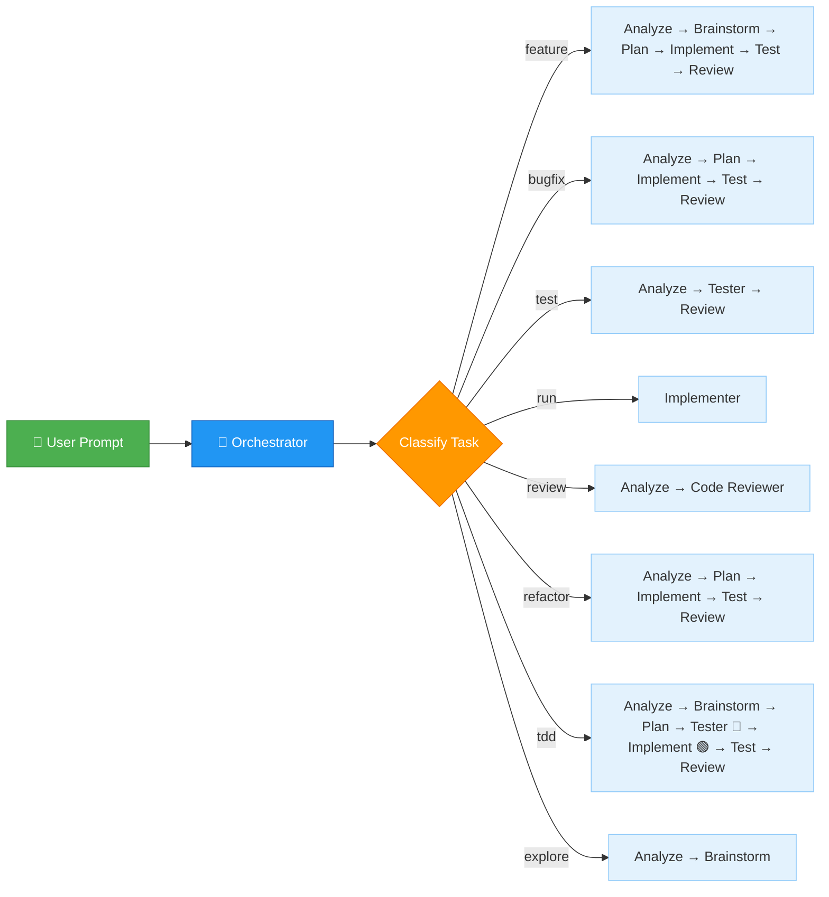
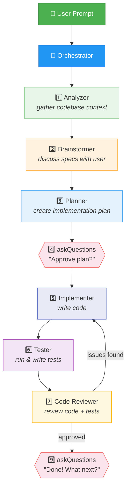

# Copilot Agent Team

A multi-agent workflow for VS Code Copilot that automates the full development lifecycle with **smart task-based routing**. The Orchestrator classifies each request and picks the optimal workflow — no fixed pipeline.

## Why Use This Agent Team

- **Task-aware routing**: the Orchestrator picks a workflow based on the request instead of forcing every task through the same pipeline.
- **Cleaner context windows**: specialized subagents work in isolated contexts, which reduces prompt bloat and keeps each step focused.
- **Better quality control**: implementation, testing, and review are separated into distinct roles, so each stage checks the previous one.
- **Stronger tool boundaries**: each agent only gets the tools it needs, which improves reliability and reduces accidental misuse.
- **Supports real development workflows**: feature work, bug fixes, test-only tasks, reviews, refactors, TDD, exploration, and command execution are all handled explicitly.

## Quick Start

### 1. Clone

```bash
git clone https://github.com/pft-IvanLim/copilot-agent.git
```

### 2. Symlink into your workspace

Create a symbolic link from your project's `.github/agents/` to this repo's agent files:

```bash
# From your project root
ln -s <copilot-agent-path>/agents .github/agents
```

Replace `<copilot-agent-path>` with the local path to this repository.

### 3. Select Orchestrator

1. Open VS Code Chat (`Ctrl+Alt+I`)
2. Click the **agent dropdown** at the bottom of the chat input
3. Select **"Orchestrator"**
4. Type your task and press Enter

The Orchestrator will classify your task and route to the right agents automatically.

---

## Architecture

The **Orchestrator** is the central brain. It classifies each task and selects the optimal workflow, calling specialized sub-agents via the `agent` tool and using `askQuestions` for user checkpoints.

### Smart Routing



### Feature Workflow (full pipeline)



**Zero handoff clicks.** All transitions are automated via subagent calls. User interaction happens only through `askQuestions` prompts.

## Agents

| Agent | Model | Tools | Role |
|-------|-------|-------|------|
| **Orchestrator** | Default | agent, vscode | Central brain — classifies tasks, routes to subagents |
| **Analyzer** | Default | read, search, web, execute | Gathers codebase context → Context Report |
| **Brainstormer** | Default | read, search, web, vscode | Discusses specs with user (via askQuestions) → Specification Report |
| **Planner** | Claude Opus 4.6 | read, search, web, agent, todo | Creates detailed implementation plan (can call Analyzer) |
| **Implementer** | GPT-5.4 | read, edit, search, execute, web, todo | Senior Engineer — writes production code |
| **Tester** | Claude Opus 4.6 | read, edit, search, execute, web, todo | Senior QA — sole owner of all test code, runs and writes tests |
| **Code Reviewer** | Claude Opus 4.6 | read, search, execute, web | Senior Engineer — reviews code + tests for correctness, bugs, security |

## Task Routing

| Task Type | Agents Used | Example Prompts |
|-----------|-------------|-----------------|
| **feature** | All agents | "Add a dark mode toggle", "Implement user authentication" |
| **bugfix** | Analyze → Plan → Implement → Test → Review | "Fix the login timeout error", "Users can't save settings" |
| **test** | Analyze → Tester → Review | "Add unit tests for the API module", "Run the test suite" |
| **run** | Implementer | "Run script.py", "Execute this command" |
| **review** | Analyze → Code Reviewer | "Review the auth module", "Check for security issues" |
| **refactor** | Analyze → Plan → Implement → Test → Review | "Extract helper functions from utils.py", "Simplify the router" |
| **tdd** | Analyze → Brainstorm → Plan → Tester(Red) → Implement(Green) → Test → Review | "Use TDD to add validation", "Test-driven: add discount calculator" |
| **explore** | Analyze → Brainstorm | "How does the caching work?", "What's the data flow?" |

## Exception Handling

| Problem | Orchestrator Action |
|---------|-------------------|
| Missing context | Re-calls Analyzer with specific questions |
| Ambiguous specs | Re-calls Brainstormer for clarification |
| Plan needs revision | Re-calls Planner with updated context |
| Implementation blocked | Asks user via askQuestions |
| Tests failing repeatedly | Presents failure details to user via askQuestions |
