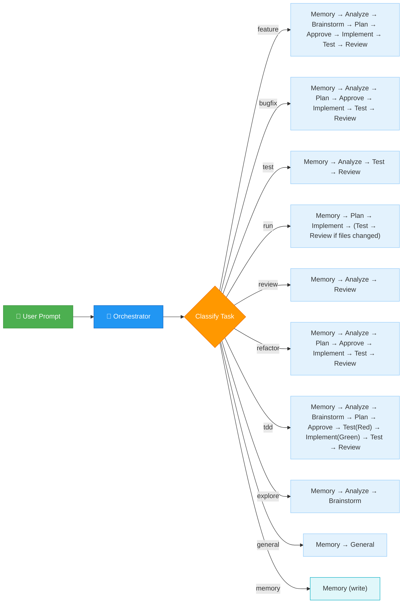
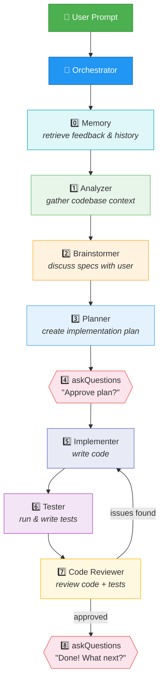
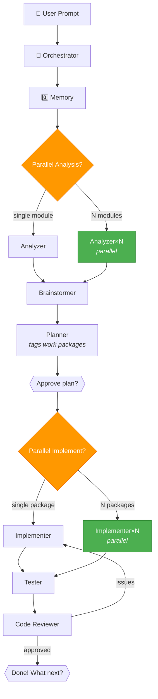
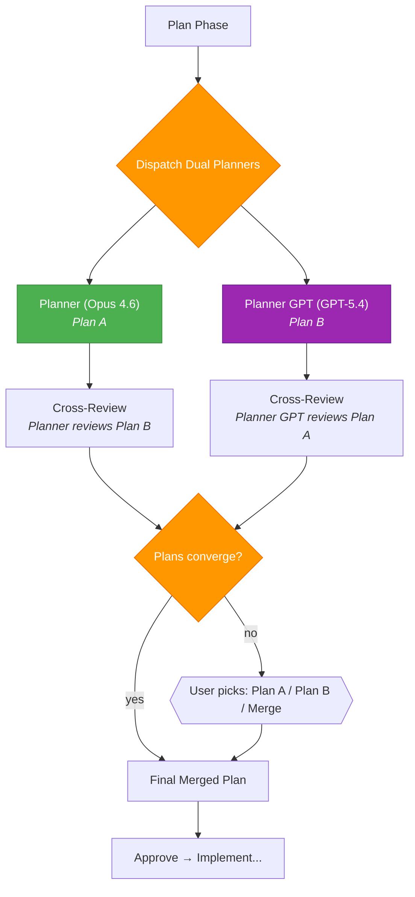

# Copilot Agent Team

A multi-agent workflow for VS Code Copilot that automates the full development lifecycle with **smart task-based routing**. The Orchestrator classifies each request and picks the optimal workflow — no fixed pipeline.

## Why Use This Agent Team

- **Task-aware routing**: the Orchestrator picks a workflow based on the request instead of forcing every task through the same pipeline.
- **Cleaner context windows**: specialized subagents work in isolated contexts, which reduces prompt bloat and keeps each step focused.
- **Better quality control**: implementation, testing, and review are separated into distinct roles, so each stage checks the previous one.
- **Stronger tool boundaries**: each agent only gets the tools it needs, which improves reliability and reduces accidental misuse.
- **Supports real development workflows**: feature work, bug fixes, test-only tasks, reviews, refactors, TDD, exploration, and command execution are all handled explicitly.

## Quick Start

### 1. Clone

```bash
git clone https://github.com/pft-IvanLim/copilot-agent.git
```

### 2. Symlink into your workspace

Create a symbolic link from your project's `.github/agents/` to this repo's agent files:

```bash
# From your project root
ln -s <copilot-agent-path>/agents .github/agents
```

Replace `<copilot-agent-path>` with the **absolute path** to this repository (e.g. `/home/user/copilot-agent`).

### 3. Select Orchestrator

1. Open VS Code Chat (`Ctrl+Alt+I`)
2. Click the **agent dropdown** at the bottom of the chat input
3. Select **"Orchestrator"**
4. Type your task and press Enter

The Orchestrator will classify your task and route to the right agents automatically.

---

## Architecture

The **Orchestrator** is the central brain. It classifies each task and selects the optimal workflow, calling specialized sub-agents via the `agent` tool and using `askQuestions` for user checkpoints.

### Smart Routing



### Feature Workflow (full pipeline)



**Zero handoff clicks.** All transitions are automated via subagent calls. User interaction happens only through `askQuestions` prompts.

## Agents

| Agent | Model | Tools | Role |
|-------|-------|-------|------|
| **Orchestrator** | Claude Opus 4.6 | agent, vscode, read, edit* | Central brain — classifies tasks, routes to subagents, creates live report |
| **Memory** | Claude Opus 4.6 | read, search, edit, vscode | Retrieves relevant feedback & history → Memory Report; writes feedback/history/session logs |
| **Analyzer** | Claude Opus 4.6 | read, search, web, edit*, vscode | Gathers codebase context → Context Report |
| **Brainstormer** | Claude Opus 4.6 | read, search, web, vscode, edit* | Discusses specs with user (via askQuestions) → Specification Report |
| **Planner** | Claude Opus 4.6 | read, search, web, agent, todo, edit* | Creates detailed implementation plan (can call Analyzer) |
| **Planner GPT** | GPT-5.4 | read, search, web, agent, todo, edit* | Alternative planner for Extra Careful mode dual-plan cross-review |
| **Implementer** | Claude Opus 4.6 | read, edit, search, execute, web, todo, vscode | Senior Engineer — writes production code |
| **Tester** | Claude Opus 4.6 | read, edit, search, execute, web, todo, vscode | Senior QA — sole owner of all test code, runs and writes tests |
| **Code Reviewer** | GPT-5.4 | read, search, execute, web, edit*, vscode | Senior Engineer — reviews code + tests for correctness, bugs, security |
| **General** | Claude Opus 4.6 | read, edit, search, execute, web, todo | Lightweight all-purpose agent for simple tasks, quick questions, atomic edits |

\* `edit` restricted to live report (`live-report.md`) and session log files only — not source code

## Task Routing

| Task Type | Phases | Example Prompts |
|-----------|--------|-----------------|
| **feature** | Memory → Analyze → Brainstorm → Plan → Approve → Implement → Test → Review → Present | "Add a dark mode toggle", "Implement user authentication" |
| **bugfix** | Memory → Analyze → Plan → Approve → Implement → Test → Review → Present | "Fix the login timeout error", "Users can't save settings" |
| **test** | Memory → Analyze → Test → Review → Present | "Add unit tests for the API module", "Run the test suite" |
| **run** | Memory → Plan → Implement → (Test → Review if files changed) → Present | "Run script.py", "Execute this command" |
| **review** | Memory → Analyze → Review → Present | "Review the auth module", "Check for security issues" |
| **refactor** | Memory → Analyze → Plan → Approve → Implement → Test → Review → Present | "Extract helper functions from utils.py", "Simplify the router" |
| **tdd** | Memory → Analyze → Brainstorm → Plan → Approve → Test(Red) → Implement(Green) → Test → Review → Present | "Use TDD to add validation", "Test-driven: add discount calculator" |
| **explore** | Memory → Analyze → Brainstorm → Present | "How does the caching work?", "What's the data flow?" |
| **general** | Memory → General → Present | "What does this function do?", "Fix this typo", "What port does this run on?" |
| **memory** | Memory (write) → Present | "Remember this", "Don't do that again", "Log this conversation", "Save what we did" |

## Exception Handling

| Problem | Orchestrator Action |
|---------|-------------------|
| Missing context | Re-calls Analyzer |
| Ambiguous specs | Re-calls Brainstormer |
| Plan needs revision | Re-calls Planner |
| Blocked / Tests failing | Asks user via askQuestions |
| Sub-agent output in a file | Reads the file directly with the read tool |
| Sub-agent fails / empty / timeout | Retries once, then asks user |
| User asks to run/execute | Re-classifies as `run` → Implement |
| Follow-up after workflow | Re-classifies from Step 0 |

## Parallel Execution

When tasks span multiple independent modules or the plan has independent work packages, the Orchestrator dispatches subagents in parallel instead of sequentially.

### Parallelization Points

| Opportunity | How It Works |
|---|---|
| **Parallel Analysis** | Task spans N independent modules → N scoped Analyzer calls in parallel → merge Context Reports |
| **Parallel Implementation** | Planner tags independent work packages (related work stays in one package) → one Implementer per package in parallel → merge Implementation Reports |
| **Parallel Test Suites** | Multiple independent test areas → Tester runs them concurrently |

### Parallel Feature Workflow



## Milestone Steering

Instead of waterfall execution, long-running agents pause at milestones via `askQuestions` so the user can steer mid-flight.

| Agent | Milestones |
|-------|------------|
| **Analyzer** | After identifying core files (user confirms scope); before finalizing report |
| **Implementer** | After each plan step or work package |
| **Tester** | After running existing tests; after writing new tests (shows descriptions, asks for more cases) |
| **Code Reviewer** | After initial scan (for reviews spanning >5 files) |

At each milestone, the agent shows progress and asks: **"Continue, Adjust, or Skip remaining?"** The user can say "Continue all" to skip future milestones.

> **Note:** Milestone steering is disabled in Fast mode.

## Execution Modes

| Mode | Triggers | Behavior |
|------|----------|----------|
| **Default** | *(no keyword)* | Full pipeline + milestones |
| **Fast** | "fast", "quick", "no milestones", "just do it", "don't overthink", "keep it simple", "straightforward", "simple", "skip discussion", "obvious", "trivial", "ez", "yolo" | No milestones, concise chat, live-report is primary |
| **Extra Careful** | "careful", "extra careful", "double check", "dual plan", "be thorough", "take your time", "think hard", "review carefully", "make sure", "paranoid", "safety critical", "important", "critical", "high stakes", "double review" | Dual-planner cross-review |

### Fast Mode

- No milestones — subagents run to completion uninterrupted
- Plan Approve still required (safety gate)
- Chat shows concise summary; full details in live-report

Example: *"fast: add input validation to the login form"*

### Extra Careful Mode

- **Plan** phase dispatches two planners in parallel (Opus 4.6 + GPT-5.4)
- Each cross-reviews the other's plan
- Final merged plan produced (or user picks if they diverge)
- All other phases work as Default

Example: *"extra careful: refactor the authentication module"*

### Extra Careful Mode Workflow



## Effort Hint System

The Orchestrator assesses task complexity and passes an **effort level** to each subagent, calibrating depth of reasoning and output verbosity.

| Level | When | Effect |
|-------|------|--------|
| `low` | Trivial: lookups, single-line edits, one command | Minimal reasoning, concise output |
| `medium` | Standard: clear requirements, single-feature, known area | Normal depth, no over-exploration |
| `high` | Complex: multi-file, ambiguous, unfamiliar code | Deep exploration, edge cases, detailed output |
| `xhigh` | Critical: security-sensitive, data migrations, core architecture | Maximum thoroughness |

**Defaults:** Default mode → `high` (adjusted down if clearly simple). Fast mode → lean `low`/`medium`. Extra Careful → lean `high`/`xhigh`.

## Live Report

Subagent output is often not visible in the VS Code chat window. To ensure full transparency, subagents write to a **live report file** as they work — giving real-time visibility:

- **Path:** `memory/chat-logs/<session-dir>/live-report.md`
- **Written by:** Each subagent directly (using `edit` restricted to this file only)
- **When:** During execution, batched with other tool calls (search, read) — zero speed penalty
- **Append-only:** Previous content is never overwritten
- **All modes:** Default, Fast, and Extra Careful all write to live-report

The Orchestrator announces the live report path at session start. Open this file to follow what subagents are doing in real time.

In **Fast mode**, the live report is the primary way to see detailed output (chat shows only summaries). In **Default** and **Extra Careful** modes, it provides real-time visibility while subagents work.

### Session Logs (written by subagents)

Each subagent writes its own detailed session log (`<agent-role>-YYYYMMDDHHMMSS.md`) at the end of execution. Subagents hold the full internal context (reasoning, searches, decisions) that would be lost if delegated. These are archival records for debugging and continuity.

## Proactive Feedback Detection

The Orchestrator auto-detects situations where feedback should be recorded — even without explicit "remember this":

- User **repeats or rephrases** the same request
- User **corrects** agent behavior ("no, I meant...", "that's wrong")
- A task **restarts** after a failed attempt
- User expresses **frustration** ("again?", "I already said...")

When detected, the Orchestrator records the correction as a feedback entry and notifies the user.
